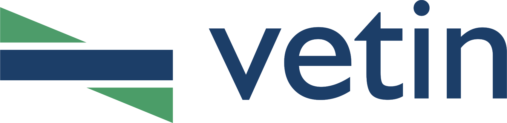

# Vetin | Plane Stress Analysis

**A browser-based computational tool for the analysis of two-dimensional stress states, principal stresses, maximum shear stresses, and stress transformations, with interactive Mohr's circle construction.**

[](https://opensource.org/licenses/MIT)
[](https://web.dev/progressive-web-apps/)
[](#-multilingual-support)
[](https://www.rasimtemur.com/vetin/planestress/)

> Developed by **Assoc. Prof. Rasim Temür** · Istanbul University-Cerrahpaşa, Department of Civil Engineering  
> Part of the **Vetin** initiative for the digitisation of academic instruction tools.

---

## 🌐 Online Access

> **[https://www.rasimtemur.com/vetin/planestress/](https://www.rasimtemur.com/vetin/planestress/)**

The application is accessible directly through a web browser without requiring any software installation, user registration, or server-side processing. All computations are performed client-side.

---

## 📋 Description

**Vetin Plane Stress Analysis** is an open-source, web-based software developed for educational use in the mechanics of materials and elasticity curricula. The application computes the complete two-dimensional stress state of a material point from the user-specified normal and shear stress components, and provides simultaneous graphical representations of the stress element, the principal stress element, the maximum shear stress element, the transformed stress element at an arbitrary inclination, and the corresponding **Mohr's circle**.

The software is intended to support both undergraduate instruction and self-directed learning by providing immediate, interactive visual feedback on the response of a material element under arbitrary plane stress conditions.

**Key properties of the application:**

- Operates entirely within the client browser; no server-side computation is required
- Functions offline as a **Progressive Web App (PWA)**, compatible with major desktop and mobile platforms
- User interface is localised in **33 languages**
- Supports **three sign-convention notations** for Mohr's circle (Engineering, Mathematical, Literature)
- Source code is freely distributed under the **MIT License**

---

## ⚙️ Functional Capabilities

### Input Parameters

The user specifies the in-plane stress components acting on the elementary material volume:

| Symbol | Quantity | Unit |
|--------|----------|------|
| **σₓ** | Normal stress on the x-face | MPa |
| **σᵧ** | Normal stress on the y-face | MPa |
| **τₓᵧ** | Shear stress on the x-face | MPa |
| **τᵧₓ** | Shear stress on the y-face (computed automatically from complementary shear) | MPa |

### Computed Output

Upon specification of the stress state, the following quantities are computed and updated instantaneously:

**Principal Stresses**
- σ<sub>max</sub>, σ<sub>min</sub> — principal normal stresses
- φ<sub>a1</sub>, φ<sub>a2</sub> — orientations of the principal planes

**Maximum Shear Stresses**
- τ<sub>max</sub>, τ<sub>min</sub> — extreme in-plane shear stresses
- φ<sub>k1</sub>, φ<sub>k2</sub> — orientations of the planes of maximum shear

**Stress Transformation**
- σ<sub>x'</sub>, σ<sub>y'</sub>, τ<sub>x'y'</sub>, τ<sub>y'x'</sub> — components on a face rotated by an arbitrary angle φ

### Mohr's Circle

A fully interactive Mohr's circle is constructed from the input stress state. The visualisation supports:

- **Step-by-step animated construction**, suitable for classroom demonstration
- **Three notation conventions** for the shear axis orientation:

| # | Notation | Description |
|---|----------|-------------|
| 1 | **Engineering (Structural)** | Shear axis directed downward; widely used in structural-engineering literature |
| 2 | **Mathematical (Theoretical)** | Shear axis directed upward; standard mathematical convention |
| 3 | **Literature** | Alternative convention encountered in classical mechanics-of-materials texts |

- Real-time correspondence between the stress element rotation and the position of the representative point on the circle
- Interactive **zoom**, **pan**, and **fit-to-screen** controls

### Graphical Stress Elements

Four synchronised graphical panels display the material element under different states:

| Panel | Contents |
|-------|----------|
| **Stress State** | Original stress element with σₓ, σᵧ, τₓᵧ, τᵧₓ |
| **Principal Stresses** | Rotated element aligned with the principal directions, displaying σ<sub>max</sub> and σ<sub>min</sub> |
| **Maximum Shear Stresses** | Element rotated to the plane of maximum shear, displaying τ<sub>max</sub> together with the corresponding mean normal stress |
| **Transformed Stress** | Element rotated by the user-specified angle φ, displaying σ<sub>x'</sub>, σ<sub>y'</sub>, and τ<sub>x'y'</sub> |

Numerical values may be toggled on or off independently for each element.

### Interactive Rotation

The transformation angle φ may be adjusted via a numerical input or a continuous slider in the range −90° to +90°. The transformed-stress element and the corresponding point on Mohr's circle update simultaneously. An optional overlay superimposes the rotated (σ<sub>x'y'</sub>) configuration on the original stress element for direct comparison.

### Data Export

- **Vector Graphics Export** — Each diagram (stress element, principal element, shear element, transformed element, Mohr's circle) may be exported individually in scalable vector graphics (SVG) format, suitable for high-resolution publishing and lecture materials.

### Interface Options

- **Three display themes** — Light, Dark, and **Blueprint** (technical-drawing style)
- **Three page layouts** — Default (three-column), Grid, and Compact
- **Fullscreen mode** — Available independently for each panel
- **Responsive mobile interface** — Tabbed navigation optimised for handheld devices

---

## 🌐 Multilingual Support

The user interface is fully localised in **33 languages**. The active language is selectable at runtime and persisted across sessions via `localStorage`:

| Code | Language | Code | Language | Code | Language |
|------|----------|------|----------|------|----------|
| `tr` | 🇹🇷 Turkish | `en` | 🇬🇧 English | `de` | 🇩🇪 German |
| `fr` | 🇫🇷 French | `es` | 🇪🇸 Spanish | `it` | 🇮🇹 Italian |
| `pt` | 🇧🇷 Portuguese | `ru` | 🇷🇺 Russian | `ro` | 🇷🇴 Romanian |
| `bg` | 🇧🇬 Bulgarian | `el` | 🇬🇷 Greek | `sl` | 🇸🇮 Slovenian |
| `sq` | 🇦🇱 Albanian | `hy` | 🇦🇲 Armenian | `ka` | 🇬🇪 Georgian |
| `he` | 🇮🇱 Hebrew | `ar` | 🇸🇦 Arabic | `fa` | 🇮🇷 Persian |
| `ur` | 🇵🇰 Urdu | `hi` | 🇮🇳 Hindi | `bn` | 🇧🇩 Bengali |
| `ne` | 🇳🇵 Nepali | `dz` | 🇧🇹 Dzongkha | `my` | 🇲🇲 Burmese |
| `th` | 🇹🇭 Thai | `id` | 🇮🇩 Indonesian | `tl` | 🇵🇭 Filipino |
| `cn` | 🇨🇳 Chinese | `ja` | 🇯🇵 Japanese | `ko` | 🇰🇷 Korean |
| `uz` | 🇺🇿 Uzbek | `tg` | 🇹🇯 Tajik | `ky` | 🇰🇬 Kyrgyz |

---

## 🛠️ Technical Implementation

The application is implemented using standard web technologies without dependency on a JavaScript framework:

| Technology | Role |
|-----------|------|
| **HTML5 / CSS3 / JavaScript (ES6+)** | Core application architecture |
| **HTML5 Canvas API** | Rendering of Mohr's circle and stress elements |
| **SVG (Scalable Vector Graphics)** | Vector export of diagrams |
| **Service Worker API** | Offline caching and PWA functionality |
| **Web App Manifest** | Home screen installation support |
| **localStorage API** | Persistence of user preferences (language, theme, layout) |

---

## 📁 Project Structure

```
planestress/
├── index.html              # Application entry point and HTML shell
├── manifest.json           # PWA manifest descriptor
├── sw.js                   # Service Worker (offline caching)
│
├── script.js               # Core computations, canvas drawing, UI logic
├── mobile.js               # Mobile-specific layout and tab navigation
│
├── translations.js         # Localisation string repository (12 languages)
│
├── style.css               # Base styles, themes (light / dark / blueprint), layouts
├── mobile.css              # Mobile viewport layout
│
├── logo.svg                # Application logotype
├── IUC.svg                 # Istanbul University-Cerrahpaşa logo
├── icon-192.png            # PWA icon (192 × 192 px)
└── icon-512.png            # PWA icon (512 × 512 px)
```

---

## 🚀 Deployment and Local Execution

### Online Access (Recommended)

The application is hosted and publicly accessible at:  
**[https://www.rasimtemur.com/vetin/planestress/](https://www.rasimtemur.com/vetin/planestress/)**

### Local Execution

As the application comprises static files only, it may be served locally using any HTTP server:

```bash
# Clone the repository
git clone https://github.com/rasimtemur/vetin-planestress.git
cd vetin-planestress

# Python 3 — built-in HTTP server
python -m http.server 8000

# Node.js — via npx
npx serve .
```

Navigate to `http://localhost:8000` in a web browser to launch the application.

### Installation as a Progressive Web App

On browsers supporting the PWA specification (Chromium-based browsers, Firefox, Safari on iOS), the application may be installed to the device home screen or desktop via the browser's **"Install"** or **"Add to Home Screen"** functionality, enabling offline access.

---

## 📖 Usage

1. **Enter the stress components** — Specify σₓ, σᵧ, and τₓᵧ in the left input panel. The complementary shear τᵧₓ is computed automatically.
2. **Read the principal results** — The principal stresses (σ<sub>max</sub>, σ<sub>min</sub>) and their orientations (φ<sub>a1</sub>, φ<sub>a2</sub>) are displayed immediately.
3. **Read the maximum shear results** — The extreme shear stresses (τ<sub>max</sub>, τ<sub>min</sub>) and their orientations (φ<sub>k1</sub>, φ<sub>k2</sub>) are displayed beneath the principal results.
4. **Rotate the element** — Adjust the angle φ via the numerical input or the slider to investigate the transformed stress state at an arbitrary orientation.
5. **Construct Mohr's circle interactively** — Activate the *step-by-step* mode (▶) to follow the geometric construction of the circle, or allow the complete circle to be drawn directly. Switch among the three notation conventions via the buttons in the toolbar.
6. **Compare configurations** — Activate the *Show σ<sub>x'y'</sub>* toggle to overlay the rotated element on the original stress state.
7. **Export results** — Each diagram may be downloaded individually as an SVG file from the panel toolbar.

---

## 📐 Computational Methodology

The plane stress state is defined by the components σₓ, σᵧ, and τₓᵧ. From the conditions of equilibrium and the rotational transformation of the stress tensor:

- **Principal stresses** are obtained from

  σ<sub>1,2</sub> = (σₓ + σᵧ)/2 ± √[((σₓ − σᵧ)/2)² + τₓᵧ²]

- **Orientations of the principal planes** satisfy

  tan(2φ<sub>a</sub>) = 2τₓᵧ / (σₓ − σᵧ)

- **Maximum in-plane shear stress** is

  τ<sub>max</sub> = √[((σₓ − σᵧ)/2)² + τₓᵧ²]

  with the corresponding planes rotated by 45° from the principal planes.

- **Transformed stress components** on a face rotated by an angle φ are obtained from the standard stress-transformation equations:

  σ<sub>x'</sub> = (σₓ + σᵧ)/2 + (σₓ − σᵧ)/2 · cos(2φ) + τₓᵧ · sin(2φ)  
  σ<sub>y'</sub> = (σₓ + σᵧ)/2 − (σₓ − σᵧ)/2 · cos(2φ) − τₓᵧ · sin(2φ)  
  τ<sub>x'y'</sub> = −(σₓ − σᵧ)/2 · sin(2φ) + τₓᵧ · cos(2φ)

- **Mohr's circle** is constructed in the (σ, τ) plane with centre at ((σₓ + σᵧ)/2, 0) and radius equal to τ<sub>max</sub>. Each rotation of the physical element by an angle φ corresponds to a rotation of 2φ along the circumference of the circle.

---

## 📜 License

This software is distributed under the **MIT License**.  
Full license terms are available in the [LICENSE](LICENSE) file.

---

## 👤 Developer

**Assoc. Prof. Rasim Temür**  
Department of Civil Engineering  
İstanbul University-Cerrahpaşa  
🌐 [rasimtemur.com](https://www.rasimtemur.com)

---

## 🔗 Vetin Project

Vetin is a collection of open-source, browser-based computational tools developed for use in civil and structural engineering education. Additional tools within the Vetin ecosystem are accessible at **[rasimtemur.com/vetin](https://www.rasimtemur.com/vetin)**.

---

<p align="center">
  <i>Developed in support of engineering education.</i><br>
  <a href="https://github.com/rasimtemur/vetin-planestress">GitHub</a> ·
  <a href="https://opensource.org/licenses/MIT">MIT License</a> ·
  <a href="https://www.iuc.edu.tr">İstanbul University-Cerrahpaşa</a>
</p>
